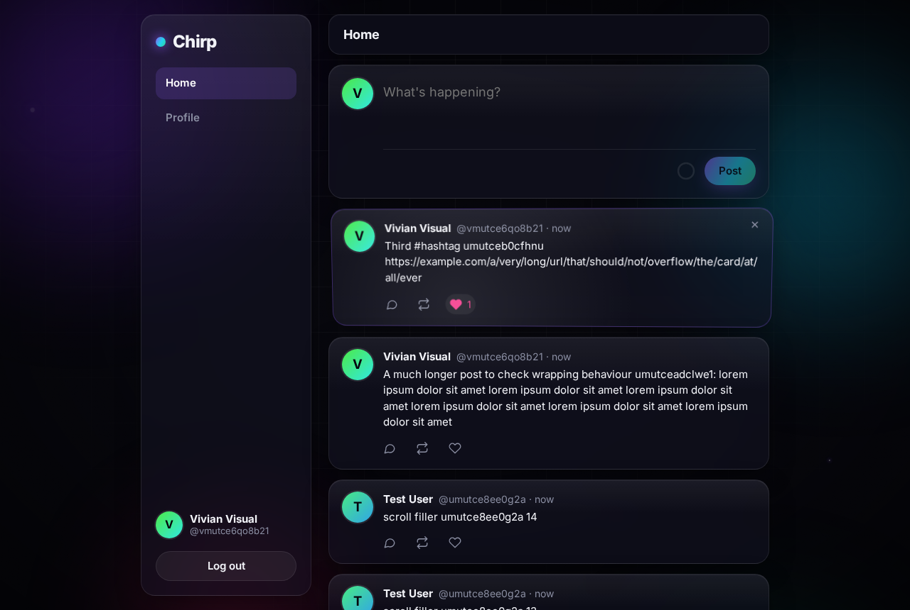
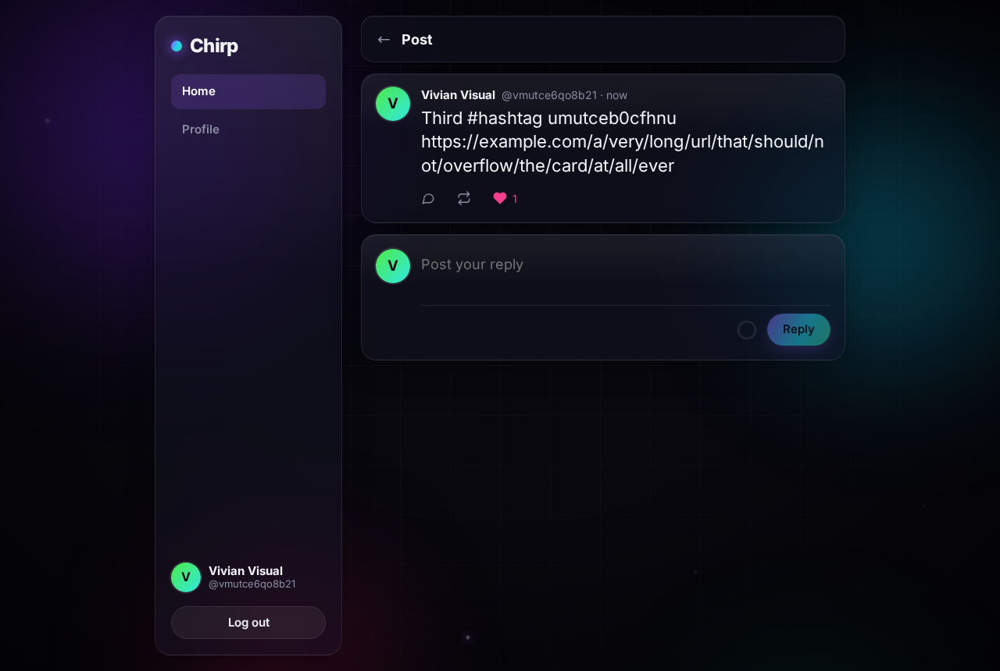
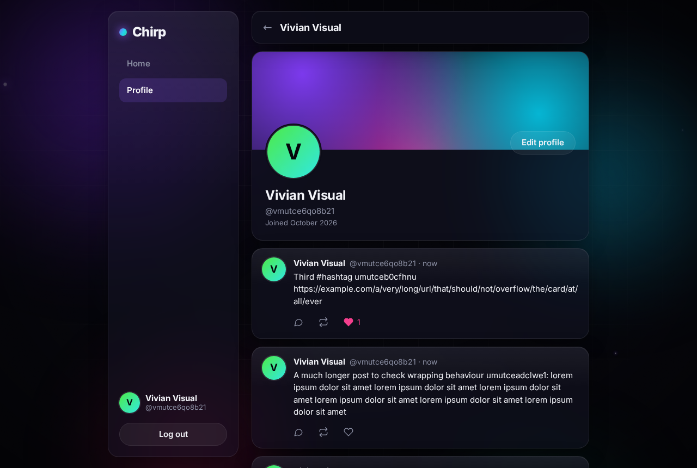
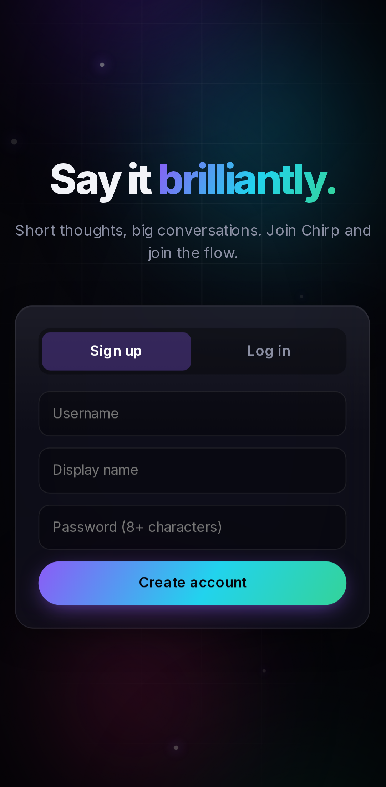
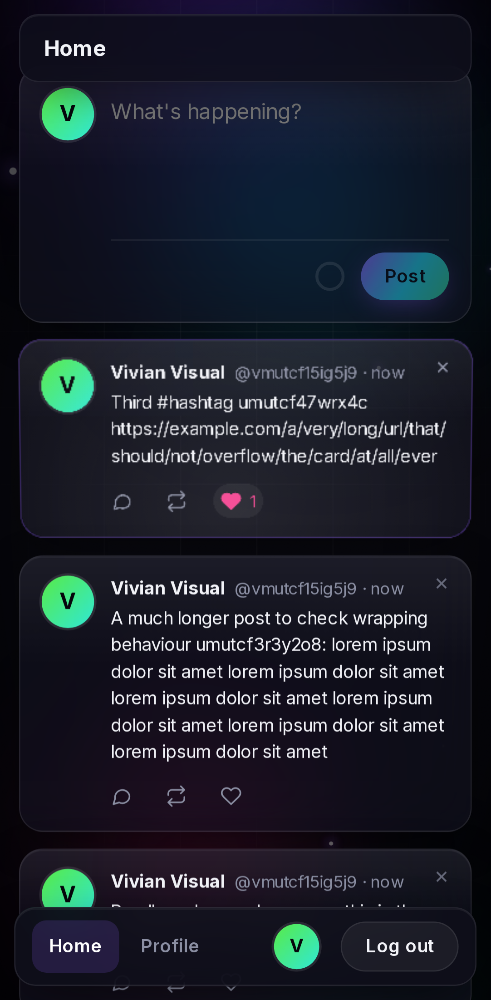
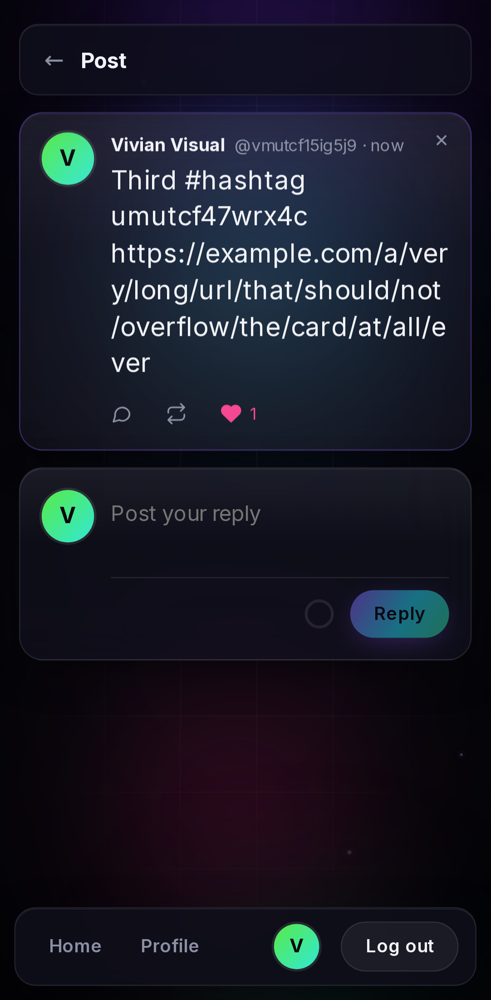
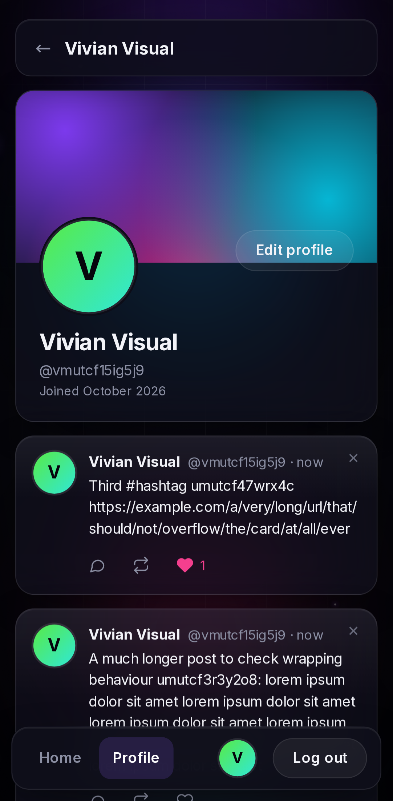

# Chirp

A slick microblogging app: React + Vite client, Fastify/TypeScript API, **MySQL** as the source of truth and **Redis** as a cache.
Dark glassmorphism UI with multi-layer parallax, pointer tilt, and GPU-composited animation.

<p align="center">
  
</p>

## Screenshots

| Feed | Post detail |
| --- | --- |
|  |  |



**Mobile** (Pixel 7 viewport): the sidebar becomes a floating bottom bar.

<p>
  
  
  
  
</p>

Screenshots are generated by the Playwright visual tests; refresh them with `npm run docs:screenshots`.

## Features
- Sign up / log in (httpOnly cookie session), profiles with editable name and bio
- Posts (280 chars), replies, likes, reposts, delete own posts
- Global feed with cursor pagination and infinite scroll
- Optimistic like/repost updates with rollback on error

## Run
```bash
docker compose up -d        # MySQL + Redis (use `docker-compose` / prefix `sudo` if your install needs it)
npm install
npm run migrate
npm run dev                 # API :3001, client :5173 (Vite proxies /api)
```
Requires Node 22+ and Docker. Copy `.env.example` to `.env`; set `JWT_SECRET` for anything non-local.

## Tests
```bash
npm test               # server API integration tests (needs the containers + migrated DB)
npm run test:client    # client unit/component tests (Vitest + Testing Library)
npm run test:e2e       # Playwright e2e + visual checks (desktop and mobile projects)
npm run test:all       # all of the above
```
Playwright starts the API (with relaxed rate limits) and Vite itself; an HTML report lands in `playwright-report/`.

## Caching
- `feed:global`: Redis sorted set of top-level post ids (capped at 1000); falls back to MySQL when cold or Redis is down.
- `post:{id}`, `user:id:{id}`, `user:name:{name}`: read-through JSON with TTL, invalidated on writes.
- Per-viewer like/repost state is always read from MySQL, never cached globally.

## Motion
Parallax layers (`Aurora`), pointer tilt (`Tilt`) and aurora drift animate only `transform`/`opacity` with `will-change`,
so they stay on the GPU compositor. `prefers-reduced-motion` disables them.

See [AGENTS.md](AGENTS.md) for architecture details and contributor/agent guidance.
