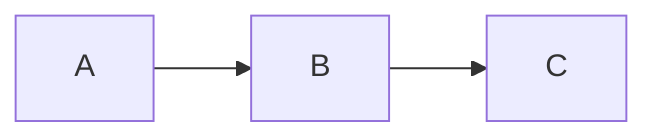

# Markdown Viewer {#top}

## Emphasis
*italic* _italic_ **bold** __bold__ ***both*** ~~strike~~ `code` ==highlight== H~2~O x^2^
Hard line break at end of this line  
next line. Escapes: \*not italic\*. Typographer: "quotes" -- dashes... (c)

## Headings
### H3
#### H4
##### H5
###### H6
Setext H1
=========
Setext H2
---------

## Lists
1. ordered
2. second
   - nested bullet
     * deeper
- [x] task done
- [ ] task todo

## Links & images
[inline](https://example.com "title") · [reference][ref] · <https://example.com> · https://autolinked.com · [back to top](#top) · [other file](README.md)


[ref]: https://example.com

## Table
| Left | Center | Right |
|:-----|:------:|------:|
| a    |   **b**    |     `c` |

## Code
```python
def hello(name: str) -> str:
    return f"hi {name}"
```

    indented code block



## Quotes & alerts
> Blockquote
>> nested

> [!NOTE]
> GitHub alert. Also TIP, IMPORTANT, WARNING, CAUTION.

> [!WARNING]
> Careful.

## Definition list
Term
: Definition of the term.

## Math
Inline $E = mc^2$ and block:

$$
\int_0^\infty e^{-x^2}\,dx = \frac{\sqrt\pi}{2}
$$

## Attributes
{.lead}
A paragraph with a class (attribute line goes above the block).

---

Footnote[^1].

<details><summary>Raw HTML</summary>Works. <kbd>Ctrl</kbd>+<kbd>O</kbd></details>

[^1]: The note.
